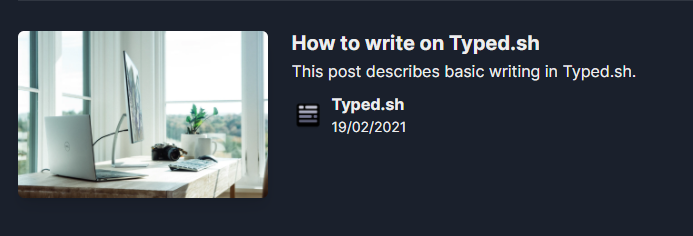
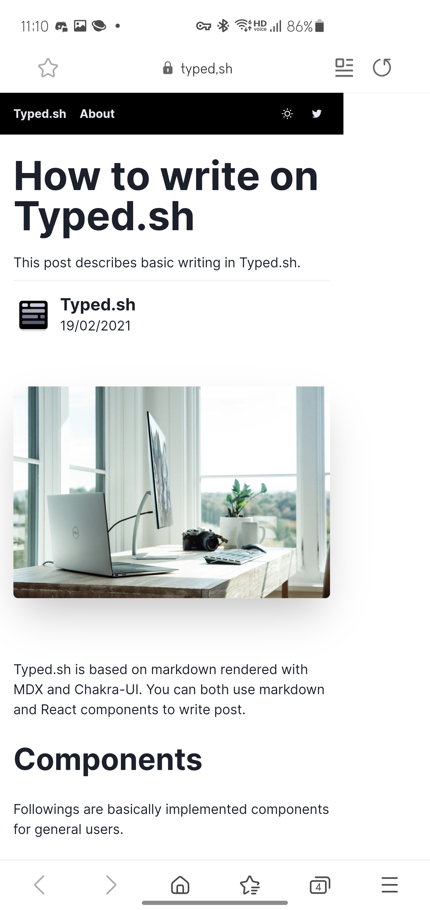

Typed.sh가 Ghost를 떠나서 자체적인 마크다운 블로그로 바뀌고 나서 발표하는 첫 릴리즈 노트입니다.
첫 번째 마크다운 블로그 안정 릴리즈이고 릴리즈 전 첫 번째 배포로부터 업데이트가 된 사항이 많습니다.

> [GitHub에서 보기: Typed-sh/blog](https://github.com/typed-sh/blog/releases/tag/v1.0.0)

### 상대경로 이미지 삽입 지원

가장 먼저 상대경로로 각각의 글에 이미지를 집어넣을 수 있게 되었습니다.
이전에는 직접 URL로 집어넣는 등의 다양한 우회 경로로 이미지를 글에 추가했어야 하지만 이제는 같은 폴더에 넣고 바로 추가할 수 있게 되었습니다.

```markdown
+ contents
  + posts
    + Release Note v1
      - index.mdx
      - image.png
```

위와 같이 이미지를 추가하였다면 이제는 바로 다음과 같이 불러올 수 있게 됩니다.

```markdown

```

가장 큰 이유로는 개발 중에 정적 HTML과 서버리스 환경에서 최대한 동일한 결과물을 제공하고 싶었기 때문에 기능 추가 전에 해결 방법을 모색할 시간을 필요로 했었습니다.
이번 버전에서는 Next.JS의 라우팅을 다음과 같이 직접 변경하고 Static Generation의 경우에는 따로 후처리를 하여 해결하게 되었습니다.

```javascript
rewrites: async () => {
  return [
    ...
    {
      source: '/post/:slug/:filename',
      destination: '/api/assets/:slug/:filename'
    }
  ]
}
```

### 글 목록에서 작성자 프로필 보기

이제 메인 페이지에 있는 글 목록에서 작성자 프로필을 바로 확인할 수 있게 되었습니다.
기존에는 글 제목 밖에 보이지 않았지만 글쓴이의 프로필 사진, 이름 그리고 날짜를 추가하였습니다.



### Chromium 기반 웹 브라우저 디자인 수정

기존에 글의 코드블럭이 Chromium 기반 웹 브라우저에서만 깨지는 현상이 발생하였지만 현재는 정상적으로 해결되었습니다.
특히 문제가 심각했던 Android 기기들의 경우에는 해상도를 초과하는 너비를 가진 코드 블럭의 경우에 웹 사이트 전체 디자인을 깨뜨리는 경우가 있었지만 이제는 정상적으로 표시됩니다.



### Favicon 추가

개발을 하면서 잊어버린 사항 중 하나인 Favicon이 추가되었습니다. 🤣

### Continuous Deployment with [Vercel Action](https://github.com/marketplace/actions/vercel-action)

GitHub Actions로 이제 블로그에 커밋이 푸시될 때마다 자동으로 배포됩니다.
원래 Vercel은 기본적으로 CD(Continuous Deployment)를 지원하지만 Organization인 경우에는 예외적으로 유료 플랜을 사용했어야 했습니다.

하지만 GitHub Actions 중 하나인 [Vercel Action](https://github.com/marketplace/actions/vercel-action)을 사용하여 쉽게 배포를 할 수 있어 더 이상 유료 플랜을 사용하지 않더라도 즉시 배포할 수 있게 되었습니다.

```yaml
name: Deploy to production

on: [
  push
]

jobs:
  deploy:
    runs-on: ubuntu-latest
    steps:
      - uses: actions/checkout@v2
      - uses: amondnet/vercel-action@v20
        with:
          vercel-token: ${{ secrets.VERCEL_TOKEN }} # Required
          github-token: ${{ secrets.GITHUB_TOKEN }} # Optional
          vercel-args: '--prod' # Optional
          vercel-org-id: ${{ secrets.ORG_ID }}  # Required
          vercel-project-id: ${{ secrets.PROJECT_ID }} # Required
          working-directory: ./
```
