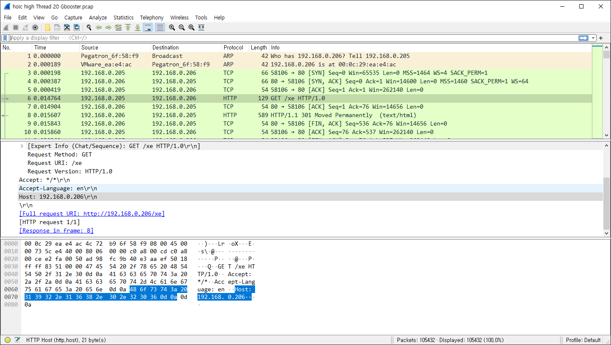
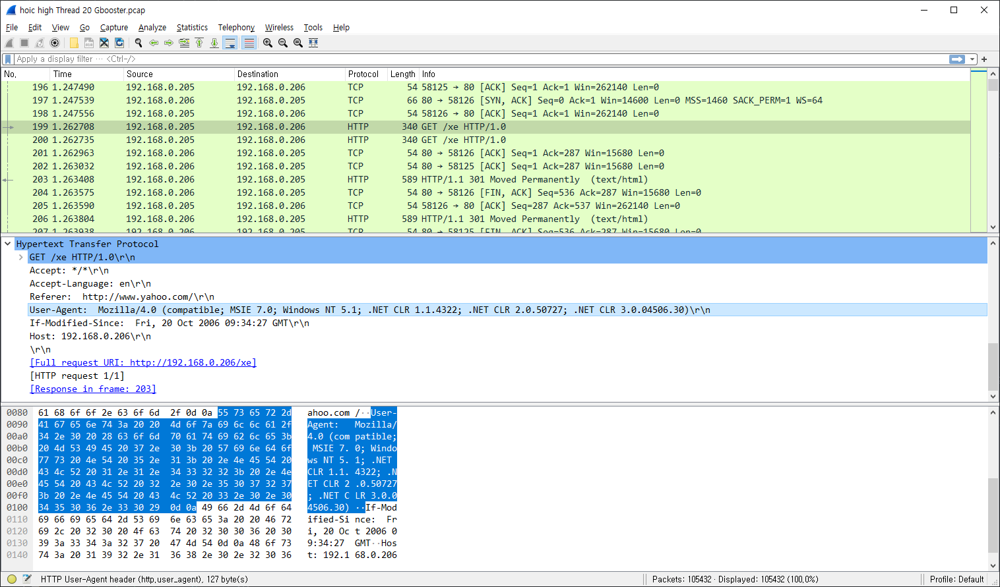

사실은 글 하나만 쓰고 자려고 했는데 서버 보호에 관하여 여러가지 생각을 많이 하게 되어서 메모할 겸 작성하게 되었습니다.
Annoymous 팀에서 만들고 꽤나 아는 사람은 아는 LOIC(Low Orbit Ion Cannon)과 HOIC(High Orbit Ion Cannon)에 대해서 간단히 설명합니다.

# Credits

먼저 이 글의 내용에 도움을 준 사람을 소개해드립니다.
생각해보니 HOIC 사례도 꽤 오래된 사례다보니 프로그램 자체를 구하는 것이 매우 어려웠습니다.
그렇다보니 이 글에 나오는 모든 자료들은 출처가 여러 군데입니다.

- Pcap: https://chrissanders.org/

# Ion Cannon

기본적으로 두 애플리케이션이 사용하는 방법은 단순한 DoS(Denial of Service)입니다.
하지만 HOIC에서는 Booster script라고 하는 VBscript가 추가되었습니다.
처음으로 제시된 LOIC은 다음과 같은 역할을 하며 Network layer 3~5 계층에서 작동하게 됩니다.
낮은 계층의 네트워크 레이어에서 동작하기 때문에 Low orbit이라는 접두사가 들어간 것 같습니다.
또한 낮은 계층에서 무의미한 패킷을 보내기 때문에 서버 부하가 적고 처리가 쉽습니다.

- 단순 TCP Flood
- 단순 UDP Flood
- HTTP GET 스팸

하지만 이번 글의 HOIC과 같은 경우에는 Network layer 7 계층에서 작동하여 서버에서 DROP하기 전까지 더 많은 연산을 요구하게 됩니다.

- HTTP GET 스팸
- HTTP POST 스팸

## Booster script 작동 원리

이 Booster script라는 단어 HOIC에서 가장 먼저 제시되었습니다.
이 Booster script는 HTTP 요청을 전송하기 전에 User-Agent 등의 평범한 헤더를 무작위로 변경하고 여러가지 의미없는 헤더를 만들고 무작위 데이터를 포함시켜 전송합니다.
그렇기 때문에 단순 iptables나 ebtables로는 차단이 완벽하지 않다고 볼 수 있습니다.
또한 iptables에서 단순 kmp 알고리즘을 사용한 문자열 확인 과정에서 conntrack으로 인해 패킷이 내부에서 stateful해지기 때문에 이러한 악성 클라이언트가 많아지면 서버의 conntrack 버퍼 제한으로 처리가 더욱 어려워집니다.

패킷 캡쳐에서 몇 개의 예시를 볼 수 있었습니다.
먼저 아래는 주체가 192.168.0.205이고 길이가 129인 HTTP 패킷입니다.



그리고 다음 패턴인 길이가 340인 패킷을 보면 아래와 같이 User-Agent 헤더의 내용이 추가 그리고 변경된 것을 확인할 수 있습니다.



그 다음은 길이가 372인 패킷을 살펴보면 또 무작위한 User-Agent 값이 들어가 있습니다.
HOIC은 이러한 무작위한 데이터를 끼워넣는 Boost script로 무작위한 문자열을 사용해 전달시켜 현재 누가 웹 사이트를 사용하는지 구별하기 어렵게 합니다.

## HOIC 차단하기

기본적으로는 nginx와 같은 웹 서버까지 패킷을 보내서 처리할 경우에는 Linux 커널 내부에서 패킷의 내부적 라우팅 경로가 추적되어 메모리를 사용하고 추가적인 성능 저하가 발생할 수 있습니다.
그렇기 때문에 최대한 앞에서 처리하는 편이 더 좋습니다.

### Iptables를 사용한 단순 IP별 패킷 ratelimit

Iptables의 Hashlimit 모듈을 사용하면 IP별로 받는 패킷을 적절히 제한할 수 있습니다.
이로써 기본적으로 사용자 당 서비스에 필요한 적당한 양을 설정할 수 있게 됩니다.

```sh
iptables \
    -A INPUT \
    -m hashlimit \
    --hashlimit-name ratelimit_req \
    --hashlimit-mode srcip \
    --hashlimit-above 75/sec \
    -j DROP
```

- INPUT 체인에 규칙 추가 (append)
- Hashlimit 모듈 로드
- 소스 IP 주소를 사용하여 제한
- 75패킷 혹은 그 이상이면
- 패킷 DROP 처리

### HTTP/1.0 Host:?

하지만 더 간단히 차단하는 방법이 있습니다.
일반적으로 프로덕션 상태로 배포되는 유명한 웹 브라우저와 달리 HOIC에는 치명적으로 이상하게 보일 수 특징이 있어 HOIC 패킷인지 특정이 가능합니다.
HTTP/1.0 스펙에는 Host 헤더가 없습니다. 하지만 HOIC에서는 모든 패킷을 항상 HTTP/1.0으로 Host 헤더를 붙여 사실상 잘못된 요청을 하고 있었습니다.
아래의 Nginx 스니펫을 사용하여 HTTP 버전과 헤더를 확인할 수 있습니다.

```
set $access "1";

if ($server_protocol ~* "HTTP/1.0") {
	set $access "${access}1";
}
if ($http_host) {
	set $access "${access}1";
}
if ($access = 111) {
	return 444; # DROP
}
```

혹은 그냥 모든 HTTP/1.0 패킷을 버리는 것도 좋은 생각입니다.
실제로 HTTP/1.0은 쓰일 일이 거의 없습니다.
만약에 패킷을 받게 되더라도 HTTP/1.0으로 다운그레이드 처리를 해야 합니다.

```
if ($server_protocol ~* "HTTP/1.0") {
	return 444; # DROP
}
```

### \r\n 접미사

그리고 추후에 조금 더 깊게 검색하며 알게 되었는데 HOIC의 패킷에 한 가지 이상한 점이 더 있습니다.
모든 요청마다 \r\n이 접미사로 포함되어 있습니다.
당시에는 이 방법 또한 한 가지의 솔루션으로 고려되었다고 합니다.
이 또한 필터링할 수 있지만 이는 훨씬 빠르게 변형될 수 있고 차단하는데에 있어서 꽤 많은 리소스를 사용하게 되므로 건너뛰도록 합니다.

이번 글의 내용은 여기까지 입니다.
